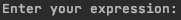
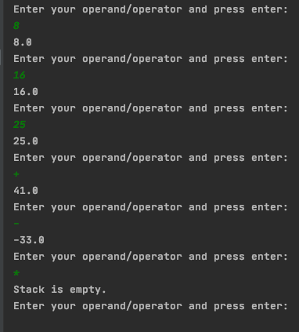

# RPN Calculator Installation/User Manual

## Installation
The .zip file you downloaded contains the RPN calculator code.

To start RPN Calculator program, apply the following steps;

- Extract the ```ZIP``` file
- Open the directory, extracted from ```ZIP``` file, in Eclipse
- In Eclipse, under the Package Explorer section, right click on the ```gokhan.ustuner``` directory and
then click ```Run As > Java Application```

## How to use?

As you run the source code as a Java application, you will be prompted for a number by the console as shown below;



Start to enter numbers, operators, and press to enter. It is shown in the image below; 



## Exceptions
Invalid both input exceptions and empty stack exceptions are caught on the code side. You are just warned,
and the loop continues.

```IOException: Invalid expression!```

```EmptyStackException: Stack is empty.```